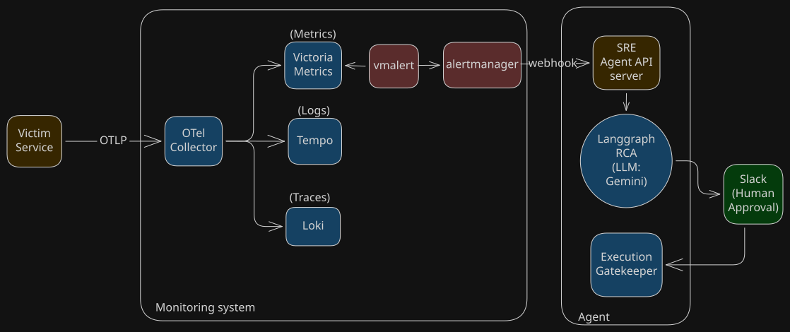
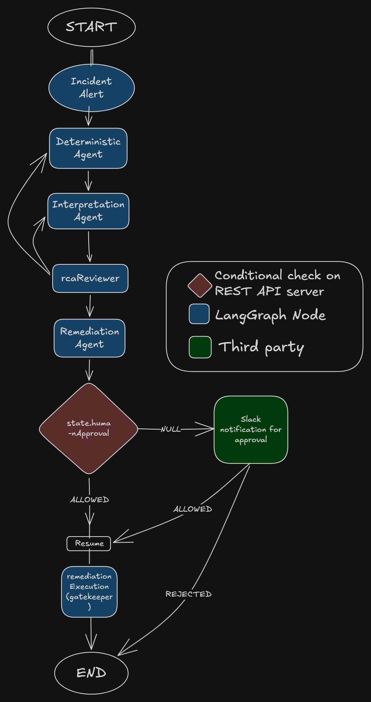

# Agentic SRE — Autonomous Incident Response with LangGraph & LTOV

An event-driven, multi-agent Site Reliability Engineering system that automatically performs Root Cause Analysis (RCA) and proposes remediations when a monitoring alert fires. Built on **LangChain** and **LangGraph**, powered by **Gemini 2.5 Flash**, and instrumented end-to-end with the **LTOV observability stack** (Loki · Tempo · OpenTelemetry · VictoriaMetrics).

---

## Table of Contents

1. [Architecture Overview](#architecture-overview)
2. [Monitoring Stack — LTOV](#monitoring-stack--ltov)
3. [Demo Environment — Victim Service & Alert Rules](#demo-environment--victim-service--alert-rules)
4. [Agentic Workflow — LangChain & LangGraph](#agentic-workflow--langchain--langgraph)
5. [RAG — Remediation Runbook Search](#rag--remediation-runbook-search)
6. [Human-in-the-Loop & Slack Integration](#human-in-the-loop--slack-integration)
7. [Docker Compose — Multi-Node Local Environment](#docker-compose--multi-node-local-environment)
8. [Getting Started](#getting-started)
9. [Project Structure](#project-structure)

---

## Architecture Overview



---

## Monitoring Stack — LTOV

The LTOV stack is the observability backbone of the system. All telemetry from the victim service flows exclusively through the **OpenTelemetry Collector**, which acts as a single fan-out pipeline to the three storage backends. The service itself never connects directly to any storage backend.

### OpenTelemetry Collector

The collector (`otel-collector-config.yaml`) is the central telemetry gateway. It receives traces, metrics, and logs over OTLP (gRPC on port `4317`, HTTP on port `4318`) and routes each signal to its dedicated backend:

- **Traces** → Grafana Tempo via OTLP/gRPC
- **Metrics** → VictoriaMetrics via Prometheus Remote Write (with exemplar preservation so that metric spike samples carry a `trace_id` for drill-down into Tempo)
- **Logs** → Grafana Loki via the native Loki push API

A `memory_limiter` processor caps the collector at 512 MiB, and a `batch` processor buffers up to 1024 records per 5-second window before exporting.

### Loki — Log Aggregation

Loki (`loki-config.yml`) runs in single-binary mode on port `3100`. It uses the `tsdb` storage backend with a v13 schema on the local filesystem and retains logs for 7 days (`168h`). Structured metadata is enabled, which allows the OTel Collector to push log records with structured attributes (e.g., `service_name`, `component`, `level`) that become Loki stream labels. The agent queries Loki using LogQL, filtering by `service_name` label and parsing JSON to match on `trace_id`.

### Tempo — Distributed Tracing

Tempo (`tempo.yaml`) listens on port `3200` and accepts OTLP traces from the collector. It stores trace blocks locally (`/var/tempo/traces`) with a WAL for durability and compacts blocks after 48 hours. Traces are indexed by `trace_id` and are queryable directly by ID, which is exactly how the `deterministicAnalyst` agent retrieves the full span tree when investigating an incident.

### VictoriaMetrics — Time-Series Metrics

VictoriaMetrics runs on port `8428` with a 7-day retention period. It is both the Prometheus-compatible scrape target and the remote-write sink for the OTel Collector. vmalert evaluates PromQL alerting rules against it on a 30-second interval. The exemplar feature is critical to the agentic workflow: metric histogram samples recorded while an active OTel span is in-flight carry the `trace_id` as an exemplar label, giving the agent a direct bridge from a fired alert → metric anomaly → distributed trace → log lines.

---

## Demo Environment — Victim Service & Alert Rules

### Victim Service

`victim-service` is a deliberately vulnerable Node.js / Express.js application that acts as the live incident target. It is fully instrumented with the OpenTelemetry Node SDK (`telemetry.js`), which initialises trace, metric, and log exporters pointing at the OTel Collector. Metrics are pushed every second; logs are shipped via a custom Winston transport that bridges `winston` log events into the OTel Logs SDK, automatically enriching each log record with the active `trace_id` and `span_id` from the current OTel context.

#### Fault-Injection Endpoints

Each endpoint deliberately induces a specific class of failure so alerts fire and the agent pipeline can be exercised end-to-end.

| Endpoint | Method | Vulnerability Induced |
|---|---|---|
| `GET /api/fault/block-loop` | GET | **Event-loop starvation** — executes a synchronous busy-spin `while` loop on the Node.js main thread for a configurable duration (default 3 s). This drives `node_event_loop_utilization` toward `1.0` and starves all async I/O. |
| `POST /api/fault/db-crash` | POST | **DB connection pool exhaustion** — simulates a PostgreSQL `FOR UPDATE NOWAIT` timeout that rejects connection acquisition. It records a `db.query_execution` span with `SpanStatusCode.ERROR` and emits structured error logs, mimicking real pool-pressure scenarios. |
| `GET /api/fault/memory-leak` | GET | **Unbounded heap growth** — appends a 20,000-element chunk (~20 MiB) of objects to a module-level global array (`memoryLeakStore`) on every call. Objects are never released, causing the V8 `old_space` heap to grow monotonically toward OOM. |
| `GET /api/fault/fd-leak` | GET | **File descriptor exhaustion** — opens a file descriptor with `fs.openSync` and intentionally never closes it, incrementing `process_open_fds` on every request toward the OS `ulimit`. |

### Alert Rules — vmalert

Alert rules are defined in `monitoring/vmalert/rules/victim-service-slis.yml` and are evaluated every 30 seconds against VictoriaMetrics. They are organised into three groups:

#### `victim-service-node-runtime`

| Alert | Condition | For | Severity | Triggered by |
|---|---|---|---|---|
| `EventLoopUtilizationWarning` | ELU > 75% | 5 m | warning | `/api/fault/block-loop` |
| `EventLoopUtilizationCritical` | ELU > 90% | 2 m | critical | `/api/fault/block-loop` |
| `V8OldSpaceUtilizationWarning` | `old_space` > 80% of max | 10 m | warning | `/api/fault/memory-leak` |
| `V8OldSpaceUtilizationCritical` | `old_space` > 90% of max | 5 m | critical | `/api/fault/memory-leak` |
| `V8OldSpaceGrowthRateAnomaly` | `old_space` growing > 50 MiB/s | 2 m | critical | `/api/fault/memory-leak` |
| `OpenFileDescriptorsWarning` | `open_fds` > 80% of max | 5 m | warning | `/api/fault/fd-leak` |
| `OpenFileDescriptorsCritical` | `open_fds` > 95% of max | 2 m | critical | `/api/fault/fd-leak` |

#### `victim-service-http`

| Alert | Condition | For | Severity |
|---|---|---|---|
| `ApiErrorRateWarning` | HTTP 5xx rate > 1% | 5 m | warning |
| `ApiErrorRateCritical` | HTTP 5xx rate > 5% | 2 m | critical |
| `ApiP99LatencyWarning` | p99 latency > 1 s | 5 m | warning |
| `ApiP99LatencyCritical` | p99 latency > 3 s | 2 m | critical |

#### `victim-service-database`

| Alert | Condition | For | Severity |
|---|---|---|---|
| `DbPoolUtilizationWarning` | active connections > 85% of max | 5 m | warning |
| `DbPoolExhaustedCritical` | active connections ≥ max | 1 m | critical |

Each alert carries an `agent_rca_hint` annotation — a plain-English clue embedded in the alert payload that is forwarded to the agent to bootstrap its investigation focus.

---

## Agentic Workflow — LangChain & LangGraph

The SRE agent is a stateful, multi-phase RCA pipeline implemented as a **LangGraph** `StateGraph`. It is compiled with a `MemorySaver` checkpointer and includes a **human-in-the-loop interrupt** after the remediation is proposed, giving an operator the ability to approve, reject, or escalate before any script touches production.

**LLM:** All agent nodes use `ChatGoogleGenerativeAI` with `gemini-3.5-flash` at `temperature: 0` for deterministic, fact-grounded outputs.



### Graph State

The shared `GraphState` (LangGraph `Annotation.Root`) carries the following fields across all nodes:

| Field | Type | Description |
|---|---|---|
| `messages` | `BaseMessage[]` | Accumulates the full conversation history (append-only via `messagesStateReducer`) |
| `incident` | `Incident \| null` | Structured alert metadata: `alertId`, `alertName`, `metricName`, `timestamp` |
| `traceId` | `string \| null` | Extracted from VictoriaMetrics exemplars on the fired alert metric |
| `traceEvents` | `OTLPEvent[] \| null` | Raw OTLP span events pulled from Tempo for stack trace enrichment |
| `deterministicAnalysis` | `string \| null` | Phase 1 output — the mechanical failure chain |
| `interpretation` | `string \| null` | Phase 2 output — systemic "why" with code-level and process-level findings |
| `reviewFeedback` | `RCAFeedback \| null` | Structured APPROVED / REJECTED verdict from the RCA Reviewer |
| `revisionCount` | `number` | Tracks how many times the reviewer has looped back |
| `proposedAction` | `ProposedAction \| null` | Script name, params, and reasoning from the Remediation Agent |
| `humanApproval` | `"pending" \| "approved" \| "rejected" \| "escalated"` | Set by the operator via Slack or REST API after the interrupt |

### Nodes & Agents

#### 1. `deterministicAnalyst` — Phase 1: The "How"

The Deterministic Analyst is the entry point of the graph. Its sole mandate is to produce a step-by-step **mechanical failure chain** by querying live telemetry. It is strictly forbidden from interpreting findings or suggesting fixes — it only documents the physics of the failure.

**Tools available:**
- `query_traces_by_id` — fetches the full distributed span tree from Tempo by `trace_id`. The raw OTLP batch is returned and span events (stack frames, exceptions) are extracted into `state.traceEvents`.
- `query_logs_by_trace` — queries Loki via LogQL for all log records matching the `trace_id` in a ±5-minute window around the alert timestamp, returning up to 500 parsed JSON log lines.
- `query_metrics` — queries VictoriaMetrics via PromQL for one or more named metrics, supporting both instant queries and range queries with a configurable time window. Results are sorted by metric name and returned with full label sets.

If `reviewFeedback` is present (i.e. the reviewer rejected and routed back here), the node injects the reviewer's `requiredCorrection.forDeterministicAnalyst` as a mandatory directive before re-running.

#### 2. `finalize_deterministic`

A pass-through node that extracts the last AI message from the `messages` array and promotes it into `state.deterministicAnalysis`. This cleanly separates tool-use conversation history from the structured output fields consumed by downstream agents.

#### 3. `interpretationAgent` — Phase 2: The "Why"

The Interpretation Agent receives `state.deterministicAnalysis` as absolute fact and is tasked with assigning **systemic meaning** to the mechanical failure. It must not query live telemetry; it works exclusively from the codebase and deployment history via its GitHub tools.

**Expected output format:** Two clearly separated sections — **Code-Level Root Cause** (which architectural flaw or logic gap permitted the fault) and **Process-Level Root Cause** (why this code reached production — missing chaos testing, CI/CD gaps, insufficient review).

**Tools available:**
- `fetch_repo_context` — fetches raw file content from GitHub at the repository's default branch, used to read the specific function or module referenced in a stack trace event.
- `fetch_commit_history_since` — fetches all commits on the repository since a given ISO timestamp, enabling the agent to detect recent changes that may have introduced the vulnerability.
- `fetch_file_from_commit` — fetches a file at a specific commit SHA, enabling the agent to diff the state of a module before and after a suspect commit.

#### 4. `finalize_interpretation`

Mirror of `finalize_deterministic` — promotes the last AI message into `state.interpretation`.

#### 5. `rcaReviewer` — Logical Gatekeeper

The RCA Reviewer is the only agent that uses **structured output** (`.withStructuredOutput()` bound to the `RCA_REVIEWER_OUTPUT_SCHEMA` Zod schema). It receives no tools; it evaluates purely by logical reasoning.

Its job is to audit the causal chain: does the systemic "why" from the Interpretation Agent directly and verifiably follow from the mechanical "how" of the Deterministic Analyst? It checks for boundary violations (did either agent stray into forbidden territory?), evidentiary backing (are claims grounded in tool output, not speculation?), and actionability (is the interpretation concrete enough for a remediation script to act on?).

**Output schema:**

```typescript
{
  status: "APPROVED" | "REJECTED",
  targetNode: "interpretationAgent" | "deterministicAnalyst" | "remediationAgent",
  logicalLeap?: string,           // Explains the flaw if rejected
  requiredCorrection?: {
    forDeterministicAnalyst?: string,
    forInterpretationAgent?: string,
  }
}
```

The routing function `routeAfterReviewer` uses `reviewFeedback.status` and `reviewFeedback.targetNode` to either advance to `remediationAgent` (APPROVED) or loop back to the earliest failed node (REJECTED), passing the correction directive in state.

#### 6. `remediationAgent` — Propose the Fix

The Remediation Agent receives the approved `state.interpretation` and is tasked with cross-referencing it against internal runbooks (via RAG) and the current execution capabilities (via the approved scripts list) to propose a safe, executable mitigation.

It is explicitly instructed that it cannot execute anything itself — it only proposes. Its final message must contain a JSON block with `scriptName`, `params`, and `reasoning`.

**Tools available:**
- `search_runbooks` — semantic similarity search over the engineering runbook via ChromaDB RAG (see [RAG section](#rag--remediation-runbook-search) below).
- `check_current_capabilities` — returns the list of filenames in the `approved_scripts/` directory, so the agent only proposes scripts that the Execution Gatekeeper is able to run.

#### 7. `finalize_remediation`

Extracts the proposed action from the last AI message using `extractProposedAction`, which parses the JSON block from the agent's response. If parsing fails, a safe fallback action (`restart_db_pool`) is used. The extracted `ProposedAction` is set into `state.proposedAction`.

**The graph pauses here** — `interruptAfter: ["finalize_remediation"]` causes the LangGraph checkpointer to serialise state and halt. The `sre-agent` server then dispatches a Slack notification to the on-call channel with interactive Approve / Reject / Escalate buttons.

#### 8. `executionGatekeeper` — Programmatic Guard (No LLM)

The Execution Gatekeeper is the only node that runs without an LLM. It is purely deterministic code that runs after the human-in-the-loop interrupt is resolved.

- If `humanApproval === "approved"`: it validates that `proposedAction.scriptName` exists in the `approved_scripts/` directory, then invokes `executeSafeScript`, which calls `spawn()` on the whitelisted shell script with the proposed params.
- If `humanApproval === "rejected" | "escalated" | "pending"`: it fires `escalateToHumanPager` with a severity level derived from the incident metric name (SEV-1 for event loop issues, SEV-2 otherwise).

**Approved scripts:**

| Script | Action |
|---|---|
| `scale_docker_compose_service.sh` | Scales the service to N replicas via `docker compose up --scale` |
| `restart_docker_container.sh` | Restarts a specific container via `docker restart` |
| `flush_pg_connections.sh` | Terminates stalled PostgreSQL connections via `pg_terminate_backend` |

### Routing Logic Summary

```
START
  └─► deterministicAnalyst ──(tool calls?)──► analyst_tools ──► deterministicAnalyst
                             └─(done)──► finalize_deterministic
                                               └─► interpretationAgent ──(tool calls?)──► interpreter_tools ──► interpretationAgent
                                                                         └─(done)──► finalize_interpretation
                                                                                          └─► rcaReviewer
                                                                                                └─(APPROVED)──────────────────────────► remediationAgent
                                                                                                └─(REJECTED → interpretationAgent)──►  interpretationAgent
                                                                                                └─(REJECTED → deterministicAnalyst)──► deterministicAnalyst
                                                                                                         remediationAgent ──(tool calls?)──► remediation_tools ──► remediationAgent
                                                                                                                           └─(done)──► finalize_remediation
                                                                                                                                            └─► [INTERRUPT — await human]
                                                                                                                                                      └─► executionGatekeeper ──► END
```

---

## RAG — Remediation Runbook Search

A simple, single-collection **Retrieval-Augmented Generation** pipeline is implemented for the `search_runbooks` tool used by the Remediation Agent.

**Stack:** ChromaDB (vector store) + Google Gemini Embedding (`gemini-embedding-2`)

### Ingestion (`src/RAG/injestion/ingestion.ts`)

**Development / Demo Setup:**
Currently, the ingestion script reads from a local, static plain-text file (`src/RAG/data/runbook.txt`). This serves as a mock knowledge base containing four structured playbooks (Event Loop Exhaustion, DB Connection Pool Exhaustion, V8 Heap Memory Leak, and File Descriptor Leak). The script uses `RecursiveCharacterTextSplitter` with `---` as a separator to map natural section boundaries into individual Chroma documents, storing them in the `morpheus_collection` with auto-generated IDs.

**Production Vision (What Actually Belongs Here):**
The `runbook.txt` file is strictly a development artifact. For production deployments and wider usage, this static ingestion pipeline must be replaced by integrations with your organization's actual institutional knowledge and dynamic data streams. 

The pipeline should be adapted to ingest and embed:
* **Historical Postmortems:** Completed incident reports to automatically surface past learnings and prevent recurring manual debugging.
* **Internal Knowledge Bases:** Live API connections to Confluence, Notion, or internal developer portals where active runbooks are maintained.
* **Ticketing Systems:** Resolved PagerDuty or Jira tickets that contain verified, engineer-approved remediation steps.
* **Web Search RAG:** Real-time retrieval pipelines querying external documentation (e.g., AWS, Node.js, or database docs) to handle novel or undocumented fault signatures.

### Retrieval (`src/RAG/index.ts`)

At query time, the `retriever` function embeds the incoming query string using `gemini-embedding-2` and performs a `collection.query()` with `nResults: 2`, returning the two most semantically similar runbook entries. The Remediation Agent passes a focused keyword query (e.g. `"event loop blocked synchronous cpu node_event_loop_utilization"`) so the embeddings return the correct playbook sections.

---

## Human-in-the-Loop & Slack Integration

After `finalize_remediation`, the graph is interrupted and the `sre-agent` server calls `sendNotiForHumanApproval`, which posts a rich interactive Block Kit message to the configured Slack channel. The message includes the incident ID, metric name, timestamp, and proposed action, along with three interactive buttons: **Approve ✅**, **Reject ❌**, and **Escalate ⚠️**.

When an operator clicks a button, Slack delivers an action payload to `POST /api/slack/actions`. The server extracts `humanApproval` and `threadId` from the payload, calls `resumeAfterHumanReview`, which patches the graph state via `rcaGraph.updateState()` and resumes execution from `finalize_remediation` into `executionGatekeeper`. The graph then completes to `END`.

---

## Docker Compose — Multi-Node Local Environment

The entire system — 9 services — runs on a single machine via `docker compose` (`monitoring/docker-compose.yml`), simulating a multi-node production-like environment using an isolated Docker bridge network named `ltov`.

### Services

| Container | Image | Port(s) | Role |
|---|---|---|---|
| `victoria-metrics` | `victoriametrics/victoria-metrics:v1.106.1` | `8428` | Time-series metrics storage & PromQL engine |
| `tempo` | `grafana/tempo:2.6.1` | `3200` | Distributed trace storage |
| `loki` | `grafana/loki:3.2.1` | `3100` | Log aggregation |
| `otel-collector` | `otel/opentelemetry-collector-contrib:0.114.0` | `4317`, `4318`, `13133` | Telemetry fan-out gateway |
| `vmalert` | `victoriametrics/vmalert:v1.106.1` | `8880` | Alert rule evaluation engine |
| `alertmanager` | `prom/alertmanager:v0.27.0` | `9093` | Alert routing & webhook dispatch |
| `sre-agent` | Built from `agent/` | `8080` | LangGraph RCA agent server |
| `chroma` | `chromadb/chroma:latest` | `8000` | Vector store for RAG |
| `express-victim-service` | Built from `victim-service/` | `3000` | Intentionally faulty target service |

### Dependency Chain & Startup Order

Compose `depends_on` ensures services start in the correct order:

```
victoria-metrics, tempo, loki
       └─► otel-collector
       └─► sre-agent (also depends on chroma)
                └─► alertmanager (waits for sre-agent healthcheck: healthy)
                └─► vmalert (depends on alertmanager)
       └─► express-victim-service (depends on otel-collector)
```

The `sre-agent` healthcheck (`GET /health`) must return `200` before `alertmanager` starts, which in turn must be up before `vmalert` can route alerts to it. This ordering guarantees that no alert webhook fires into an unready agent.

### Networking

All services share the `ltov` bridge network. Inter-service DNS resolution uses the Compose service name as hostname (`http://tempo:3200`, `http://loki:3100`, etc.). The victim service is configured to send OTLP only to `http://otel-collector:4318` — never directly to any backend. Port bindings expose each service to the host machine for local debugging (e.g., Grafana can be pointed at `localhost:8428` and `localhost:3100`).

### Persistent Volumes

Named volumes (`vm-data`, `tempo-data`, `loki-data`, `chroma-data`) ensure that metric history, traces, logs, and vector embeddings survive container restarts.

## Getting Started

### Prerequisites

- Docker & Docker Compose v2
- A Gemini API key (for the LLM and ChromaDB embeddings)
- A Slack bot token and channel ID (optional — for interactive approval messages; see step 6)

---

### 1. Configure environment

Create `monitoring/.env` directly:

```bash
cat > monitoring/.env << 'ENV'
GEMINI_API_KEY=your-key-here
GEMINI_MODEL=gemini-2.5-flash
SLACK_BOT_TOKEN=xoxb-...          # optional
SLACK_CHANNEL_ID=C...             # optional
ENV
```

`TEMPO_URL`, `LOKI_URL`, and `VICTORIA_METRICS_URL` are pre-wired to Docker network hostnames in `docker-compose.yml` and do not need to be set here.

---

### 2. Start the full stack

```bash
cd monitoring
docker compose up -d --build
```

Wait for the agent to pass its health check before continuing — Alertmanager won't start until it does:

```bash
docker compose logs -f sre-agent
# Ready when you see: [sre-agent] listening on http://0.0.0.0:8080
```

---

### 3. Ingest the RAG knowledge base

The ChromaDB client inside the agent hardcodes the `chroma` Docker network hostname, so the ingestion script must run **inside the running container**, not on your host machine:

```bash
docker exec sre-agent npx tsx src/RAG/injestion/injestion.ts
```

> **Replacing the runbook with real content:** Drop your postmortem reports, wiki exports, or any plain-text runbooks into `agent/src/RAG/data/`, update the loader path in `injestion.ts`, rebuild the container, and re-run this step. The `search_runbooks` tool will then retrieve from your actual incident history.

---

### 4. Trigger a fault

```bash
# Block the event loop (triggers EventLoopUtilizationCritical after ~2 min of sustained load)
watch -n 1 curl -s http://localhost:3000/api/fault/block-loop?duration=3000

# Exhaust the DB connection pool (triggers on HTTP 500 error rate spike)
curl -X POST http://localhost:3000/api/fault/db-crash \
  -H "Content-Type: application/json" -d '{}'

# Grow the V8 heap (triggers V8OldSpaceUtilizationCritical after repeated calls)
for i in {1..50}; do curl -s http://localhost:3000/api/fault/memory-leak > /dev/null; done

# Leak file descriptors (triggers ProcessOpenFdsHigh after repeated calls)
for i in {1..200}; do curl -s http://localhost:3000/api/fault/fd-leak > /dev/null; done
```

---

### 5. Watch the agent run

```bash
# Stream agent logs
docker compose logs -f sre-agent
```

Or skip the alert wait entirely by posting a mock webhook directly:

```bash
curl -X POST http://localhost:8080/webhook/vmalert \
  -H "Content-Type: application/json" \
  -d '{
    "alerts": [{
      "fingerprint": "test-001",
      "labels": {
        "alertname": "EventLoopUtilizationCritical",
        "service_name": "express-victim-service",
        "metric_name": "node_event_loop_utilization",
        "severity": "critical"
      },
      "startsAt": "'"$(date -u +%Y-%m-%dT%H:%M:%SZ)"'"
    }]
  }'
```

The response body contains the `threadId` you need for the next step.

---

### 6. Approve or reject the proposed remediation

The graph pauses after the remediation agent proposes an action and waits for a human decision before executing anything.

**Via Slack** (if configured): the agent posts an interactive message with Approve / Reject / Escalate buttons. For Slack's callback to reach your local agent, expose the endpoint with a tunnel:

```bash
ngrok http 8080
# Set Request URL in your Slack App → Interactivity to:
# https://<subdomain>.ngrok.io/api/slack/actions
```

**Via REST** (no Slack needed):

```bash
# threadId is the alert fingerprint — "test-001" in the mock example above
curl -X POST http://localhost:8080/api/incidents/test-001/resume \
  -H "Content-Type: application/json" \
  -d '{"humanApproval": "approved"}'

# Other valid values: "rejected", "escalated"
```

On `approved`, the Execution Gatekeeper runs the script proposed by the remediation agent. On `rejected` or `escalated`, it fires the mock pager instead. Only scripts present in `agent/src/approved_scripts/` can ever be executed.

---

## Project Structure

```
.
├── agent/                        # SRE agent (LangGraph / TypeScript)
│   ├── src/
│   │   ├── graph.ts              # LangGraph StateGraph definition & edge routing
│   │   ├── index.ts              # Webhook entry point & human-in-the-loop resume logic
│   │   ├── server.ts             # Express HTTP server (webhook + Slack action receiver)
│   │   ├── state.ts              # GraphState Annotation schema
│   │   ├── nodes/
│   │   │   ├── agentNodes.ts     # All LLM agent node implementations
│   │   │   ├── executionGatekeeper.ts  # Deterministic gatekeeper (no LLM)
│   │   │   └── prompts.ts        # System prompts for all agents
│   │   ├── tools/
│   │   │   └── index.ts          # Tool definitions (Loki, Tempo, VictoriaMetrics, GitHub, RAG, scripts)
│   │   ├── RAG/
│   │   │   ├── data/runbook.txt  # Engineering runbook (4 fault playbooks)
│   │   │   ├── index.ts          # Retrieval function
│   │   │   └── injestion/        # ChromaDB ingestion pipeline
│   │   ├── approved_scripts/     # Whitelisted shell scripts for execution
│   │   └── utils/                # Message helpers, Slack client, output schemas
│   ├── Dockerfile
│   └── package.json
│
├── victim-service/               # Intentionally faulty Express.js target
│   ├── index.js                  # Fault-injection endpoints
│   ├── telemetry.js              # OTel SDK bootstrap (traces + metrics + logs)
│   └── Dockerfile
│
└── monitoring/                   # LTOV stack configuration
    ├── docker-compose.yml        # Full 9-service Compose definition
    ├── otel-collector-config.yaml
    ├── loki/loki-config.yml
    ├── tempo/tempo.yaml
    ├── prometheus/prometheus.yml  # VictoriaMetrics self-scrape
    ├── vmalert/rules/
    │   └── victim-service-slis.yml  # 14 PromQL alert rules
    └── alertmanager/alertmanager.yml
```
---

## Optimizations and Enhancements

1. Remediation agent does not know what arguments to pass for each of the approved scripts, add a feature so that checkCurrentCapabilities tool gives script argument information to the LLM.
2. Only RCA analysis review is done in the current workflow, add another review loop for remediation script review
3. Review loop to assess the environment after remediation script execution. To provide feedback whether the remediation was successful or further inspection is needed.
4. A UI for adding approved scripts and agent state or an addition to already existing monitoring tool UIs